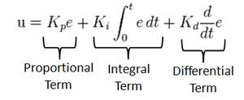

# C++ Boilerplate
[](https://travis-ci.org/KrishnaBhatu/Week4808x)
[](https://coveralls.io/github/KrishnaBhatu/Week4808x?branch=master)
---
## Author
```
Team A - Part 2
[Driver]-Ashwin Goyal(Ghost1995)
[Navigator]-Indushekhar Prasad Singh(indushekhar) 
Team B - Part 1
[Driver]-Krishna Suresh Bhatu(KrishnaBhatu)
[Navigator]-Bhargav Dandamudi(bhargav-umd) 
```
## Overview

Desiging a PID controller to achieve a setpoint velocity.

PID Block Diagram


## Working

The controller calculates error which we get from the setpoint value and the actual value
Now, 3 parameters are calculated for getting the actual velocity such that the error is minimized and the actual value reaches the setpoint value.
1) The Proportional parameter: This parameter gets affected directly by the error. So, for larger errors we get a large change in the actual value.
2) The integral parameter: This parameter is defined as the integral of parameter over time. So, when the error is less, the proportional term tends to reduce and the effects of the integral term comes to be visible.
3) The derivative term: This parameter is defines as the derivative of the error with respect to time. It provides a dampering effect, so for rapid changes in the error, this provides a greater controlling effect and dampers the error.

PID Formula




## Standard install via command-line
```
git clone https://github.com/KrishnaBhatu/Week4808x
cd <path to repository>
mkdir build
cd build
cmake ..
make
Run tests: ./test/cpp-test
Run program: ./app/shell-app
```
## Building for code coverage (for assignments beginning in Week 4)
```
sudo apt-get install lcov
cmake -D COVERAGE=ON -D CMAKE_BUILD_TYPE=Debug ../
make
make code_coverage
```
This generates a index.html page in the build/coverage sub-directory that can be viewed locally in a web browser.

## Plugins

- CppChEclipse

    1. In Terminal, open the main directory.

    2. Run cppcheck --enable=all --std=c++11 -I include/ --suppress=missingIncludeSystem $( find . -name *.cpp | grep -vE -e "^./build/" -e "^./vendor/" )


- Google C++ Sytle

    1. In Terminal, open the main directory.

    2. Run cpplint $( find . -name \*.h -or -name \*.cpp | grep -vE -e "^./build/" -e "^./vendor/" -e "^./docs/" -e "^./results" )

